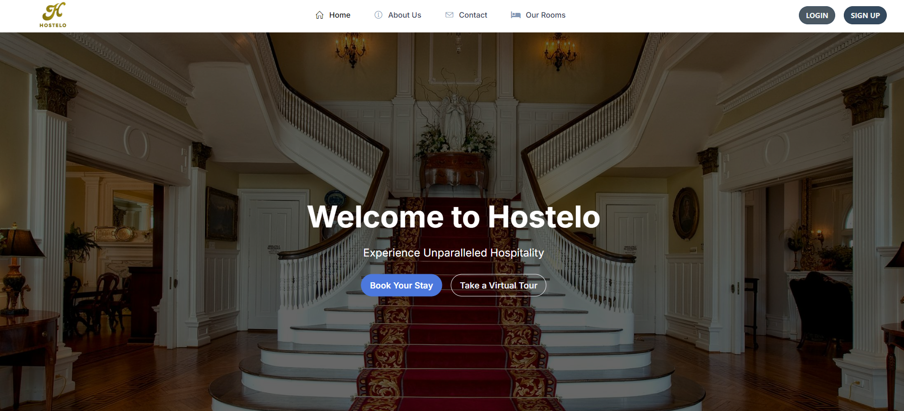
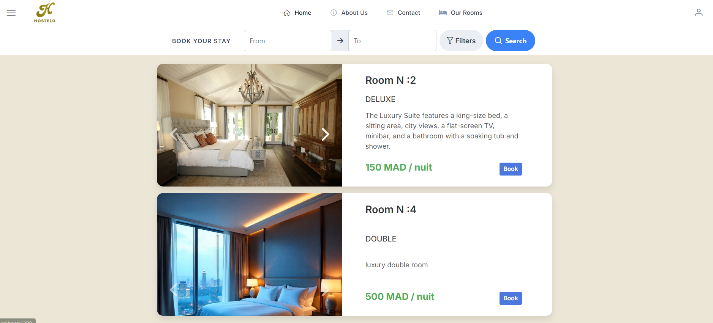
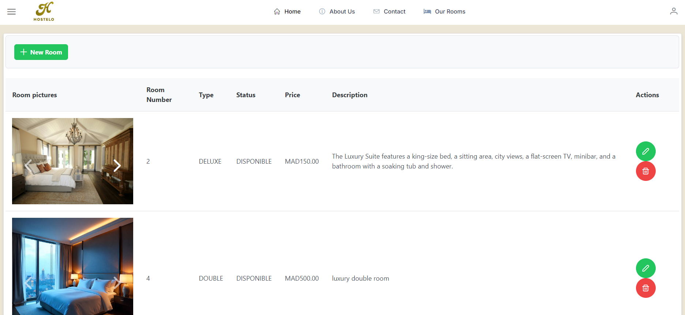
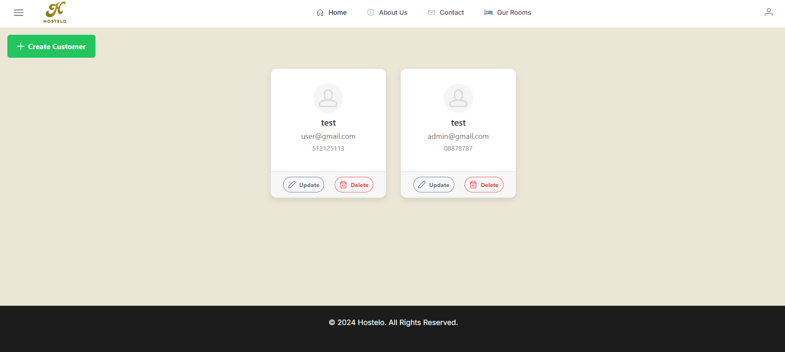
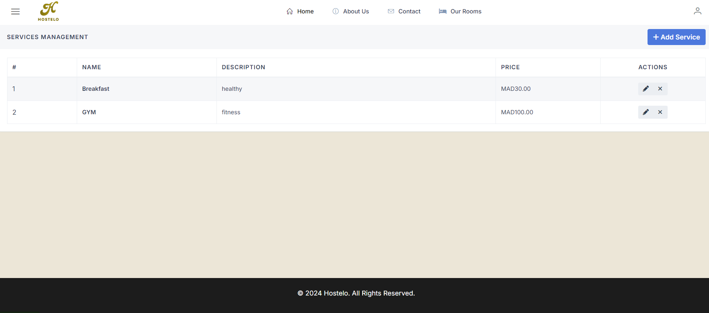
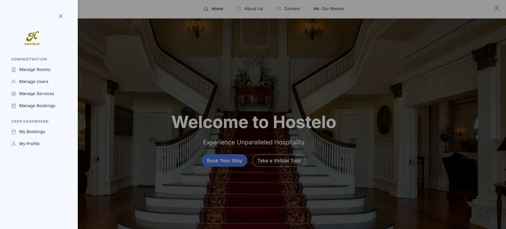

<div align="center">

# 🏨 Hostelo

### Enterprise-Grade Hotel Management System

[](https://spring.io/projects/spring-boot)
[](https://angular.io/)
[](https://www.postgresql.org/)
[](LICENSE)

*Streamline your hotel operations with intelligent reservation management, real-time room tracking, and seamless client experiences.*

[Features](#-features) • [Demo](#-screenshots) • [Installation](#-quick-start) • [Documentation](#-api-documentation) • [Contributing](#-contributing)

</div>

---

## 🌟 Why Hostelo?

Hostelo transforms hotel management into a seamless digital experience. Built with modern enterprise architecture, it delivers:

- **⚡ Real-time Operations** - Instant booking updates and room availability tracking
- **🔐 Bank-Grade Security** - JWT authentication with role-based access control
- **📊 Intelligent Dashboard** - Data-driven insights for better decision making
- **🎯 Intuitive UX** - Clean, responsive interface that staff love to use
- **🔄 Scalable Architecture** - Microservices-ready design for future growth

---

## 🎬 Screenshots

<div align="center">

### Landing Experience


### Secure Authentication


### Reservation Command Center


<details>
<summary>📸 View More Screenshots</summary>

### Room Management


### Client Relations


### Service Catalog


### Admin Control Panel


### Profile Management


</details>

</div>

---

## ✨ Features

### 🏢 Core Functionality

| Module | Capabilities |
|--------|-------------|
| **📅 Reservations** | Create, modify, cancel bookings • Check-in/out workflows • Conflict prevention |
| **👥 Client Management** | Customer profiles • History tracking • Loyalty integration |
| **🛏️ Room Operations** | Real-time availability • Housekeeping status • Pricing tiers |
| **🎁 Service Catalog** | Dining • Spa • Amenities • Custom packages |
| **👨‍💼 Administration** | User roles • System config • Reporting • Analytics |

### 🔒 Security & Performance

- ✅ JWT token-based authentication
- ✅ Spring Security integration
- ✅ Role-based authorization (Admin/Staff/Guest)
- ✅ Password encryption with BCrypt
- ✅ API rate limiting & CORS protection
- ✅ Optimized database queries with JPA

---

## 🛠️ Tech Stack

<div align="center">

### Frontend Architecture


### Backend Infrastructure


### Development Tools


</div>

---

## 🚀 Quick Start

### Prerequisites

Ensure you have installed:
- **Java 17+** - [Download JDK](https://adoptium.net/)
- **Node.js 16+** - [Download Node](https://nodejs.org/)
- **PostgreSQL 15+** - [Download PostgreSQL](https://www.postgresql.org/download/)
- **Maven 3.8+** - [Download Maven](https://maven.apache.org/download.cgi)
- **Angular CLI** - `npm install -g @angular/cli`

### 📥 Installation

```bash
# Clone the repository
git clone https://github.com/L7ZM/Hostelo.git
cd Hostelo
```

### 🗄️ Database Setup

```sql
-- Create database
CREATE DATABASE hostelo_db;

-- Create user (optional)
CREATE USER hostelo_admin WITH PASSWORD 'your_secure_password';
GRANT ALL PRIVILEGES ON DATABASE hostelo_db TO hostelo_admin;
```

### ⚙️ Backend Configuration

1. Navigate to backend directory and configure `application.properties`:

```properties
# Database Configuration
spring.datasource.url=jdbc:postgresql://localhost:5432/hostelo_db
spring.datasource.username=hostelo_admin
spring.datasource.password=your_secure_password

# JPA Configuration
spring.jpa.hibernate.ddl-auto=update
spring.jpa.show-sql=true
spring.jpa.properties.hibernate.dialect=org.hibernate.dialect.PostgreSQLDialect

# JWT Configuration
jwt.secret=your-secret-key-min-256-bits
jwt.expiration=86400000

# Server Configuration
server.port=8080
```

2. Build and run the backend:

```bash
cd backend
mvn clean install
mvn spring-boot:run
```

Backend will run on **http://localhost:8080**

### 🎨 Frontend Configuration

```bash
cd frontend
npm install

# Development server
ng serve
```

Frontend will run on **http://localhost:4200**

### 🐳 Docker Deployment (Optional)

```bash
# Build and run with Docker Compose
docker-compose up -d
```

---

## 📚 API Documentation

### Authentication Endpoints

| Method | Endpoint | Description |
|--------|----------|-------------|
| POST | `/api/auth/register` | Register new user |
| POST | `/api/auth/login` | Authenticate user |
| POST | `/api/auth/refresh` | Refresh JWT token |

### Reservation Endpoints

| Method | Endpoint | Description |
|--------|----------|-------------|
| GET | `/api/reservations` | Get all reservations |
| GET | `/api/reservations/{id}` | Get reservation details |
| POST | `/api/reservations` | Create new reservation |
| PUT | `/api/reservations/{id}` | Update reservation |
| DELETE | `/api/reservations/{id}` | Cancel reservation |

### Room Management

| Method | Endpoint | Description |
|--------|----------|-------------|
| GET | `/api/rooms` | List all rooms |
| GET | `/api/rooms/available` | Get available rooms |
| POST | `/api/rooms` | Add new room |
| PUT | `/api/rooms/{id}` | Update room details |

*Full API documentation available via Swagger UI at `/swagger-ui.html` when running the backend.*

---

## 🏗️ Project Structure

```
Hostelo/
├── backend/
│   ├── src/main/java/com/hostelo/
│   │   ├── config/          # Security & app configuration
│   │   ├── controller/      # REST API endpoints
│   │   ├── model/           # JPA entities
│   │   ├── repository/      # Database layer
│   │   ├── service/         # Business logic
│   │   └── security/        # JWT & authentication
│   └── pom.xml
│
├── frontend/
│   ├── src/app/
│   │   ├── components/      # UI components
│   │   ├── services/        # API integration
│   │   ├── models/          # TypeScript interfaces
│   │   ├── guards/          # Route protection
│   │   └── interceptors/    # HTTP interceptors
│   └── package.json
│
└── demo/                    # Screenshots
```

---

## 🧪 Testing

```bash
# Backend tests
cd backend
mvn test

# Frontend tests
cd frontend
ng test

# E2E tests
ng e2e
```

---

## 🤝 Contributing

We welcome contributions! Here's how you can help:

1. **Fork** the repository
2. **Create** a feature branch (`git checkout -b feature/AmazingFeature`)
3. **Commit** your changes (`git commit -m 'Add some AmazingFeature'`)
4. **Push** to the branch (`git push origin feature/AmazingFeature`)
5. **Open** a Pull Request

### Development Guidelines

- Follow existing code style and conventions
- Write meaningful commit messages
- Add tests for new features
- Update documentation as needed
- Ensure all tests pass before submitting PR

---

## 🗺️ Roadmap

- [ ] Mobile application (React Native)
- [ ] Payment gateway integration
- [ ] Multi-language support
- [ ] Advanced analytics dashboard
- [ ] Email notification system
- [ ] Inventory management module
- [ ] Third-party booking platform integration

---

## 📄 License

This project is licensed under the **MIT License** - see the [LICENSE](LICENSE) file for details.

---

## 👨‍💻 Author

**L7ZM**

[](https://github.com/L7ZM)

---

## 🌟 Show Your Support

If you find this project helpful, please consider giving it a ⭐️!

---

<div align="center">

### Built with ❤️ for the hospitality industry

**[Report Bug](https://github.com/L7ZM/Hostelo/issues)** • **[Request Feature](https://github.com/L7ZM/Hostelo/issues)**

</div>
